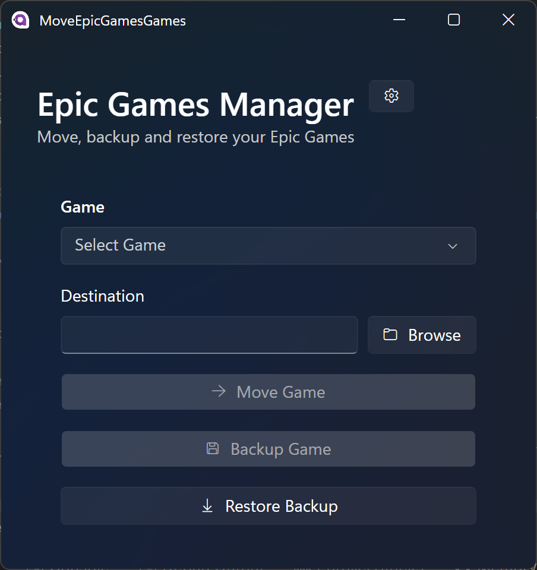

# Epic Games Manager

Epic Games Manager is designed to help you manage your EGL Games because it can't. With this tool, you can easily move, backup, and restore your games.

<!-- screenshots here -->


## Features

- **Move Games**: Relocate installed games to different drives or locations.
  - Automatically updates Epic Games Launcher configuration.
  - Preserves game functionality after moving.
  - Handles all game files and dependencies.

- **Backup Games**: Create compressed backups of your installed games.
  - Support for ZIP compression (.epiczip).
  <!-- - Support for LZ4 compression (.epiclz4). -->
  - Backup includes all necessary game files.

- **Restore Backups**: Easily restore game backups.
  - Choose custom restore location.
  - Automatic Epic Games Launcher integration.

## Requirements

- Windows 10/11
- .NET 8.0 Runtime
- Epic Games Launcher (EGL) installed

## Installation

### From Release (not available yet)
1. Download the latest release from the [Releases](https://github.com/MinshuG/MoveEpicGamesGames/releases) page.
2. Extract the zip file.
3. Run `MoveEpicGamesGames.exe`.

### Building from Source

1. Install prerequisites:
   - Visual Studio 2022 or JetBrains Rider
   - .NET 8.0 SDK
   - Git (optional)

2. Clone the repository:
   ```bash
   git clone https://github.com/MinshuG/MoveEpicGamesGames.git
   ```

3. Open the solution in your IDE or build from command line:
   ```bash
   cd MoveEpicGamesGames
   dotnet build
   ```

4. Run the application:
   ```bash
   dotnet run
   ```

## Usage

1. **Moving Games**:
   - Select a game from the dropdown list.
   - Click "Browse" to choose a new location.
   - Click "Move Game" to start the process.

2. **Creating Backups**:
   - Select a game.
   - Click "Backup Game".
   - Choose a save location for the backup file.

3. **Restoring Backups**:
   - Click "Restore Backup".
   - Select a backup file (.epiczip or .epiclz4).
   - Choose where to restore the game.

## TODOs
- Add support for LZ4 compression.
- Add support for DLCs
- Verify backup integrity during restoration.


## Important Notes

- Close the Epic Games Launcher before moving or restoring games.
- Ensure adequate disk space at the destination.
- Administrator privileges may be required for modifying game installations.

## License

This project is licensed under the GNU General Public License v3.0 - see the [LICENSE](LICENSE.md) file for details.
