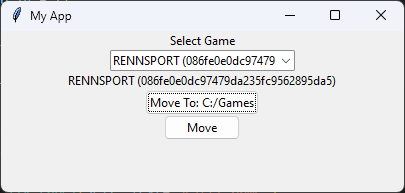

### simple tool to move epic games' games to another drive/folder

## Usage
1. make sure you have python installed
2. run the script with `python main.py`
### Make sure you have enough space on the destination drive/folder

### Note
games with dlcs aren't supported yet
